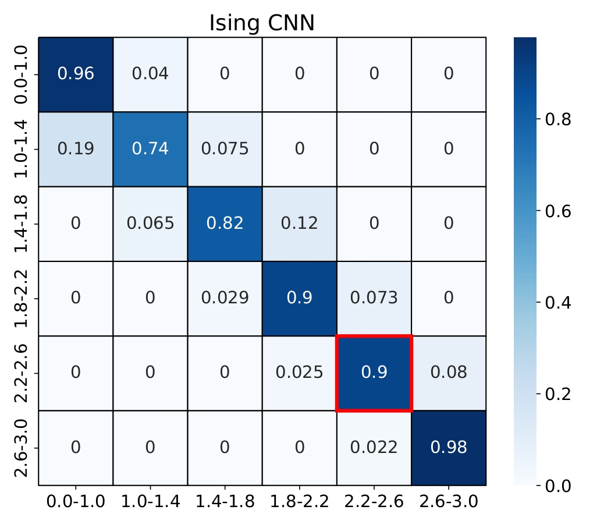
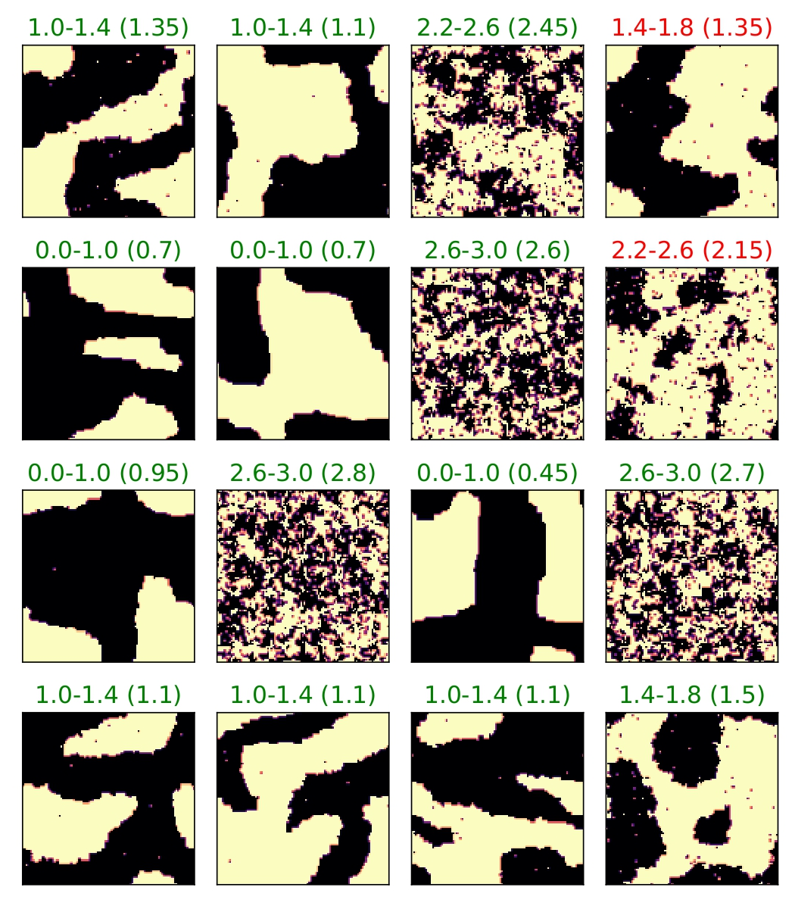
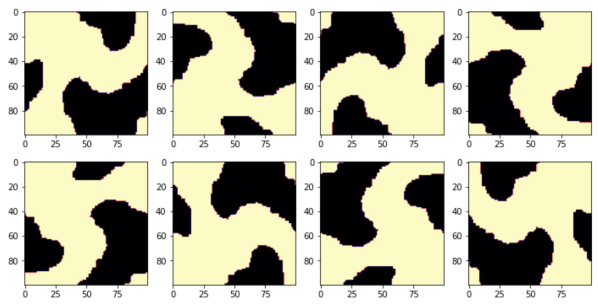

### CNN classification of Ising model temperature

I use TensorFlow to implement Convolutional Neural Network(CNN)
for Ising model temperature classification. Follow [this link]() for notebook with code.

  

  

    Fig. 1: Confusion matrix for temperature classification. Red box highlights temperature close to phase transition.
  
 

Dataset for ~50k images is generated using single-spin-flip Monte-Carlo.

  

  

    Fig. 2: Classification of temperature for different spin configurations.
  
 

Spin configurations are also rotated and reflected to enlarge the dataset(x8).

  

  

    Fig. 3: Modification of configurations to make dataset larger. 
  
 

