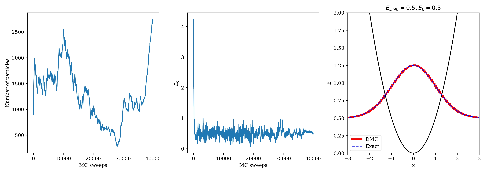
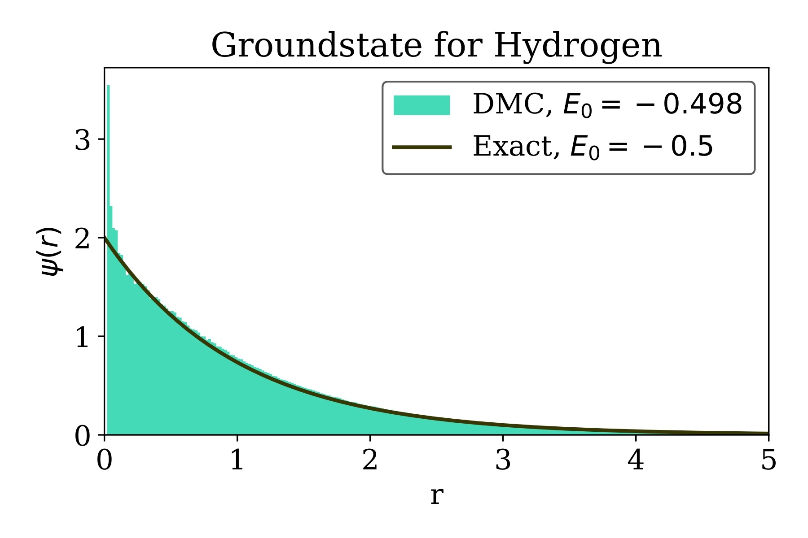

### Diffusion Monte Carlo

Diffusion Monte-Carlo is a useful tool for computing groundstate wavefunction and energy of quantum systems. [Here](https://github.com/mgoloshchapov/Sandbox/blob/main/ComputationalQM/DMC/DMC.ipynb) I implement basic version of DMC algorithm and give several examples of its work.

__Idea and Examples__

Suppose you want to find groundstate wavefunction and energy of a quantum system. If we replace time with imaginary time $t \rightarrow - i\tau$, arbitrary state will evolve as:

$$\left| \psi(\tau) \right>  = \sum_{n}c_n e^{- E_n \tau/ \hbar} \left| \psi_n \right>$$

We see that all summands decay exponentially. Now if we make energy shift equal to the ground state energy $E_0$, arbitrary state would evolve as

$$\left| \psi(\tau) \right>  =c_0 \left| \psi_0 \right>  + \sum_{n \neq 0}c_n e^{- (E_n-E_0) \tau/ \hbar} \left| \psi_n \right>,$$

so as $\tau \rightarrow \infty$ 

$$\left| \psi(\tau) \right> \rightarrow c_0 \left| \psi_0 \right> .$$

If initial projection of state on the ground state is not zero, we will eventually receive ground state of our system. By running algorithm with different energy shifts $E$ we can find one that doesn't grow/decay exponentially, which would correspond to ground state energy $E_0$.

  
  

    Fig. 1: DMC groundstate for harmonic oscillator
  
 

To implement the above idea DMC initializes particles in the desired potential and starts branching random walk consisting of two steps:

- _Diffusive displacements_.
  Particles randomly walk and visit different states. 

- _Birth-Death processes_.
  Each particle is either replicated or removed depending on the potential energy in the current state.

Here is the visualization of particles in the double well potential and sampling of groundstate wavefunction. As the particle approaches coordinate where wavefunction(and hence probability) is close to zero, it likely dies(red circles). On the other hand, particles give birth in regions, where wavefunction amplitude is large(green circles).

  

  

    Fig. 2: Pligrims birth&death processes in the double-well.
  
 

  

  

    Fig. 3: Groundstate sampling in the double-well.
  
 

Finally, DMC can be used to find groundstate of the Hydrogen atom:

  

  

    Fig. 3: Hydrogen atom groundstate radial part.
  
 

References:

[1] Ioan Kosztin et al., ["Introduction to the diffusion Monte-Carlo method"](https://arxiv.org/abs/physics/9702023v1)
