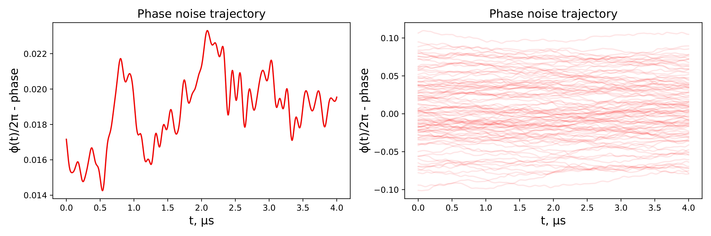
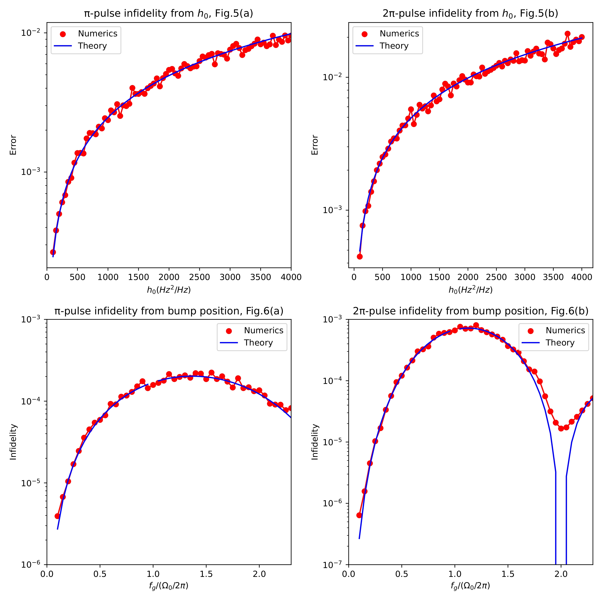

### Laser phase noise and Qubit decoherence.

Frequency stablization of laser to a reference cavity leads to the emergence of servo-bumps, which is a laser phase noise localized at some frequencies. 
Also, there is a white noise in spectral density of the laser phase noise. 

  

  

    Fig. 1: Laser phase noise spectral density.
  
 

Laser phase noise trajectories are sampled as a sum of cosines with random phases uniformly distributed on $[0, 2\pi]$ 
and amplitudes defined by laser phase noise spectral density.

  

  

    Fig. 2: Laser phase noise trajectory with parameters from [1].
  
 

Influence of white noise and servo-bump on single-qubit rotations is investigated according to [1].

  

  

    Fig. 3: Comparison of modelling with theory from [1].
  
 

References:

[1] "Sensitivity of quantum gate fidelity to laser phase and intensity noise", X. Jiang, J. Scott, Mark Friesen, and M. Saffman
Phys. Rev. A 107, 042611, 2023

