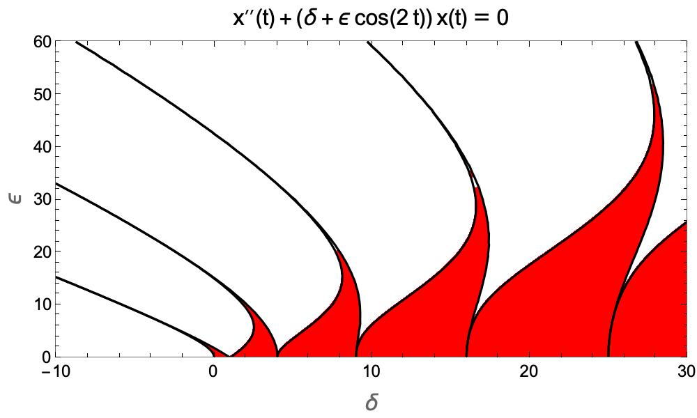
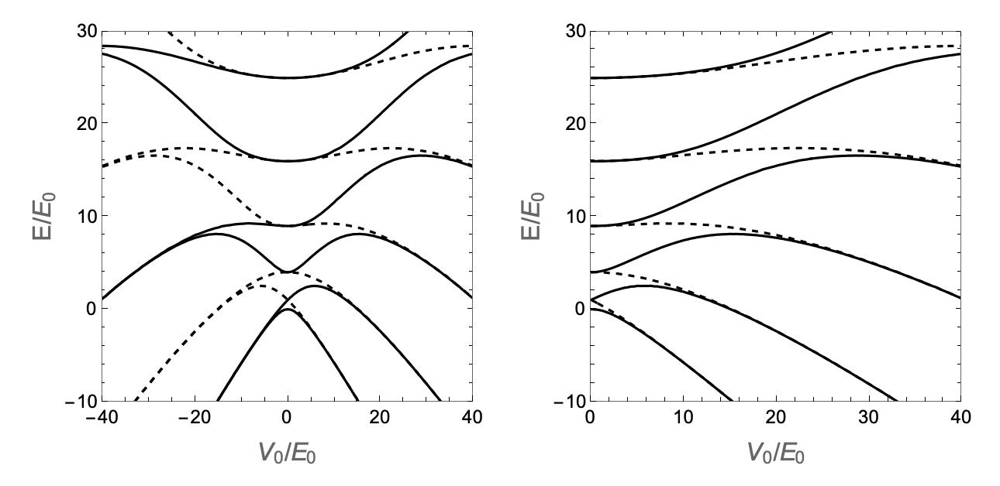

__Mathieu equation stability diagram__

Stability regions of Mathieu equation.

  

  

    Fig. 1: Stability diagram for Mathieu equation. Stable regions are drawn in red.
  
 

Mathieu equation also describes quantum particle in 1D cosine potential:

$$H = -\frac{\hbar^2}{2m}\frac{d^2}{dx^2} + \frac{V_0}{2}\cos\left(2kx\right)$$

  

  

    Fig. 2: Spectrum of particle in 1D cosine potential.
  
 

__References:__

[1] https://personal.math.ubc.ca/~ward/teaching/m605/every2_floquet1.pdf

[2] Martin Holthaus, "Floquet engineering with quasienergy bands of periodically driven optical lattices"