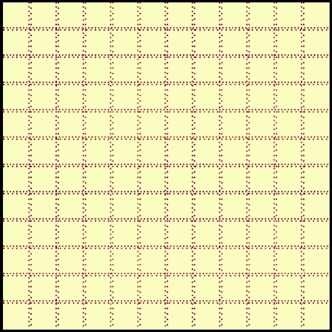
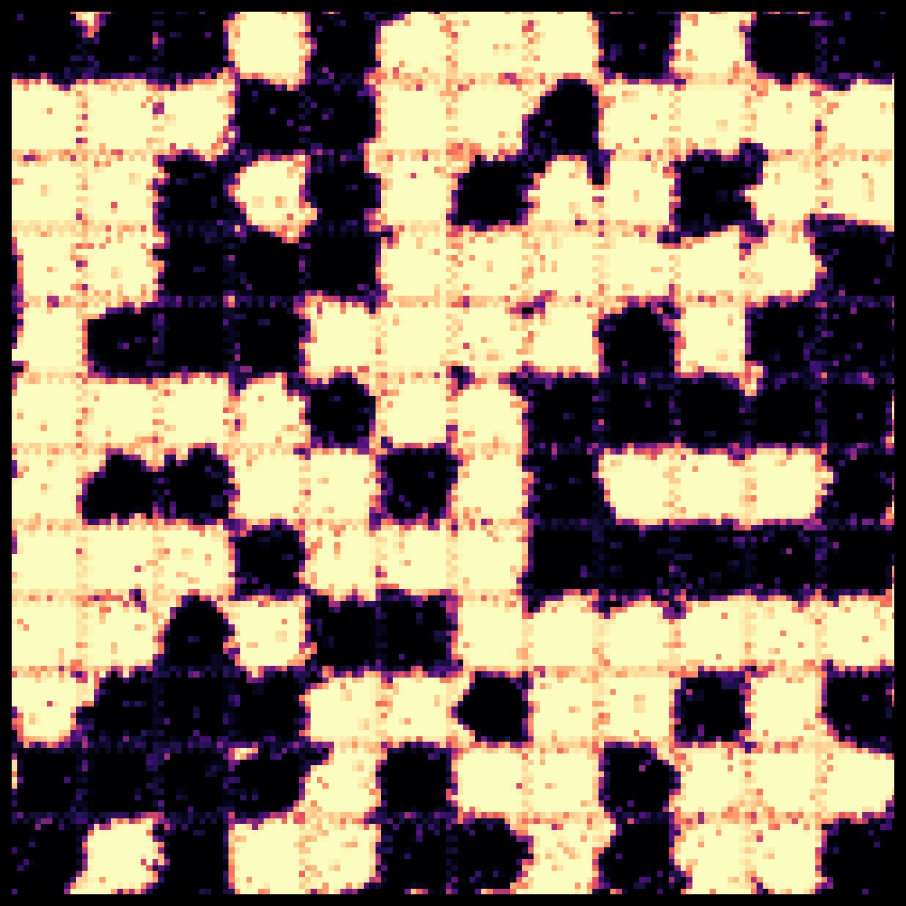
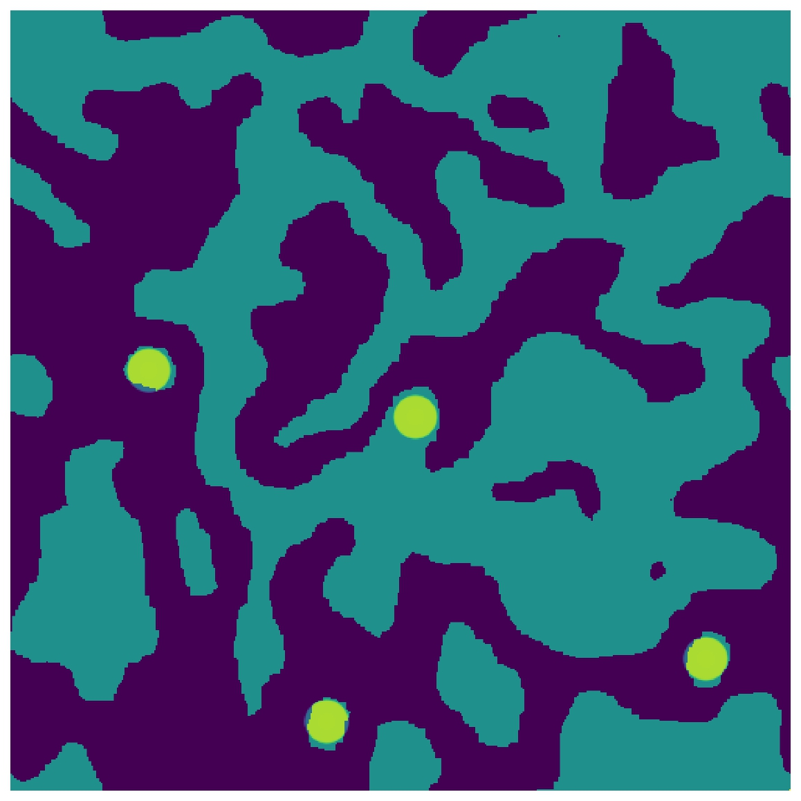

### Domain wall pinning & Magnetic memory in Ising model.

What happens with spin configurations in Ising model if we add impurities?

  

  

    Fig. 1: Spin-zero impurities on 2D lattice.
  
 

We receive domain wall pinning!

  

  

    Fig. 2: Domain walls pin to impurities and form square cells.
  
 

By estimating correlation length for spins we can adjust square cell size formed by impurities 
to reduce correlations between adjacent cells, so Monte-Carlo sweeps don't change cell magnetization.

  

  

    Fig. 3: Circles with radius equal to correlation length received from autocorrelation function. 
            Correlation length is a good estimate for domain thickness.
  
 

Now if we start applying local magnetic field to individual cells,
we can change magnetization of the whole cell. 
This corresponds to writing information in it. 

Due to the educated choice of 
square cell size, adjacent cells almost don't interact with each other, so information can be stored inside them.

  

  

    Fig. 4: Local magnetic field changes magnetization of cells. Monte-Carlo sweeps don't change magnetization of cells.
  
 

