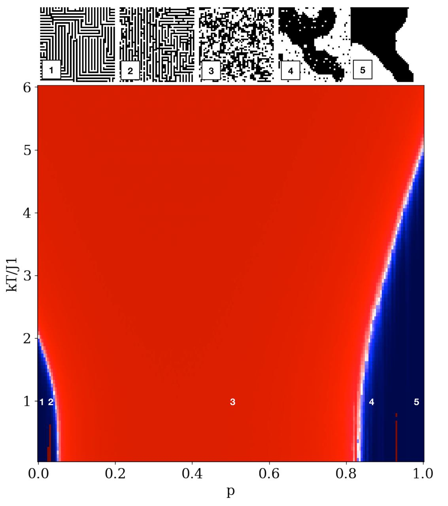

### Ising model with random interactions

Consider Ising model on 2D lattice with next-nearest-neighbour interactions. 

- Nearest neighbours interact ferromagnetically

- Diagonal neighbours interact ferromagnetically with probability $ p $ and 
antiferromagnetically with probability $1-p$

Using single-spin-flip Monte-Carlo we can generate spin configurations and measure correlation 
length between spins with autocorrelation function. Tuning probability $p$ and temperature $T$ of this model, we
receive phase diagram of random-bond Ising model!

  

  

    Fig. 1: Random-bond Ising model phase diagram with correlation length as order parameter. Numbers on phase diagram correspond to different phases above.
  
 

[_Jupyter-notebook_](https://github.com/mgoloshchapov/Sandbox/blob/main/Ising/notebooks/random_Ising.ipynb)

__References:__

[1] Sora Cho, Matthew P.A. Fisher, ["Criticality in the two-dimensional random-bond Ising model."](https://arxiv.org/abs/cond-mat/9607175v2)